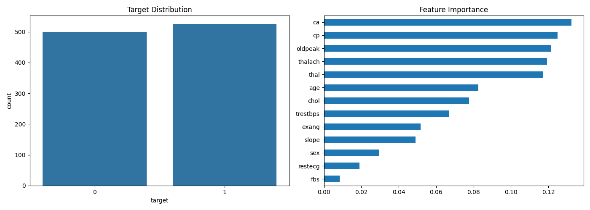
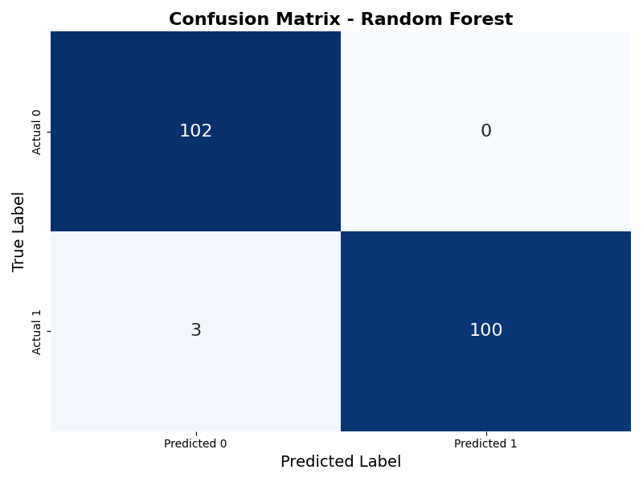
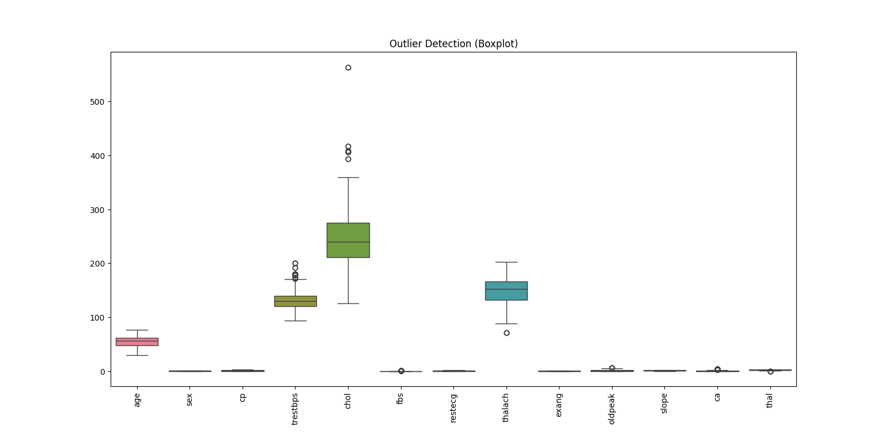
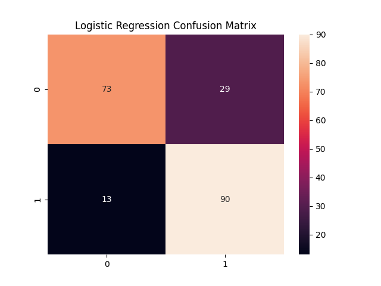
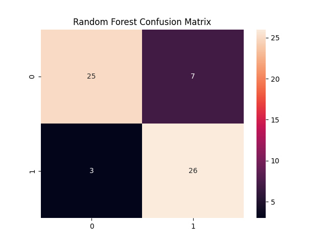
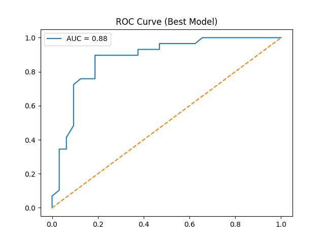

# ❤️ Heart Disease Prediction using Machine Learning

## 🚀 Project Overview
This project uses Machine Learning to predict the risk of heart disease based on medical attributes such as blood pressure, cholesterol, chest pain type, and heart rate.

The goal is to assist early medical diagnosis and reduce the risk of undetected heart disease.

---

## 📊 Dataset
- Source: UCI / Kaggle Heart Disease Dataset
- Samples: 1025 patients
- Features: 13 medical attributes
- Target:
  - 0 → No Heart Disease
  - 1 → Heart Disease

---

## 📌 Features Description (Medical Context)
- cp → Chest pain type
- trestbps → Resting blood pressure
- chol → Serum cholesterol
- thalach → Maximum heart rate achieved
- oldpeak → ST depression
- ca → Number of major vessels

---

## ⚙️ Data Preprocessing
- Handling missing values
- Feature scaling using StandardScaler
- Train/Test split (80/20)
- Outlier detection using Boxplots

---

## 🤖 Machine Learning Models
- Logistic Regression
- Random Forest Classifier (Best Model)

---

## 📈 Model Evaluation

### Why Recall matters in Medical ML?
In healthcare prediction, **Recall is more important than Accuracy** because missing a sick patient (False Negative) is very dangerous.

---

## 🏆 Results

| Model                | Accuracy | Key Metric Focus |
|---------------------|----------|------------------|
| Logistic Regression | ~80%     | Balanced         |
| Random Forest       | ~98%     | High Recall      |

---
## 📊 Visualizations

### 🔸 Target Distribution


### 🔸 Feature Importance


### 🔸 Correlation Heatmap


### 🔸 Confusion Matrix


### 🔸 ROC Curve


### 🔸 Outlier Detection (Boxplot)


---

## 📉 Key Insights
- Chest pain type is a strong predictor of heart disease
- Maximum heart rate significantly impacts diagnosis
- Some features show strong correlation with the target

---

## 🛠️ Tech Stack
- Python
- Pandas
- NumPy
- Scikit-learn
- Matplotlib
- Seaborn

---

## 🚀 How to Run

```bash
git clone https://github.com/USERNAME/Heart-Disease-Prediction.git
cd Heart-Disease-Prediction

pip install -r requirements.txt
python main.py

